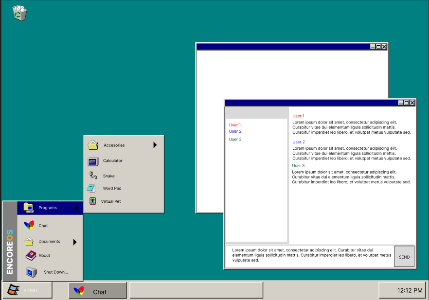
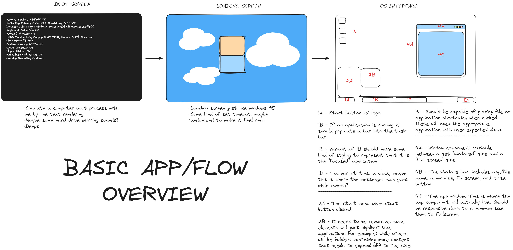
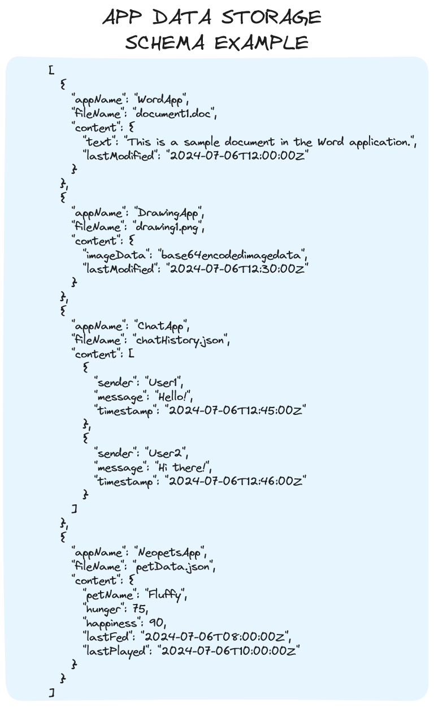
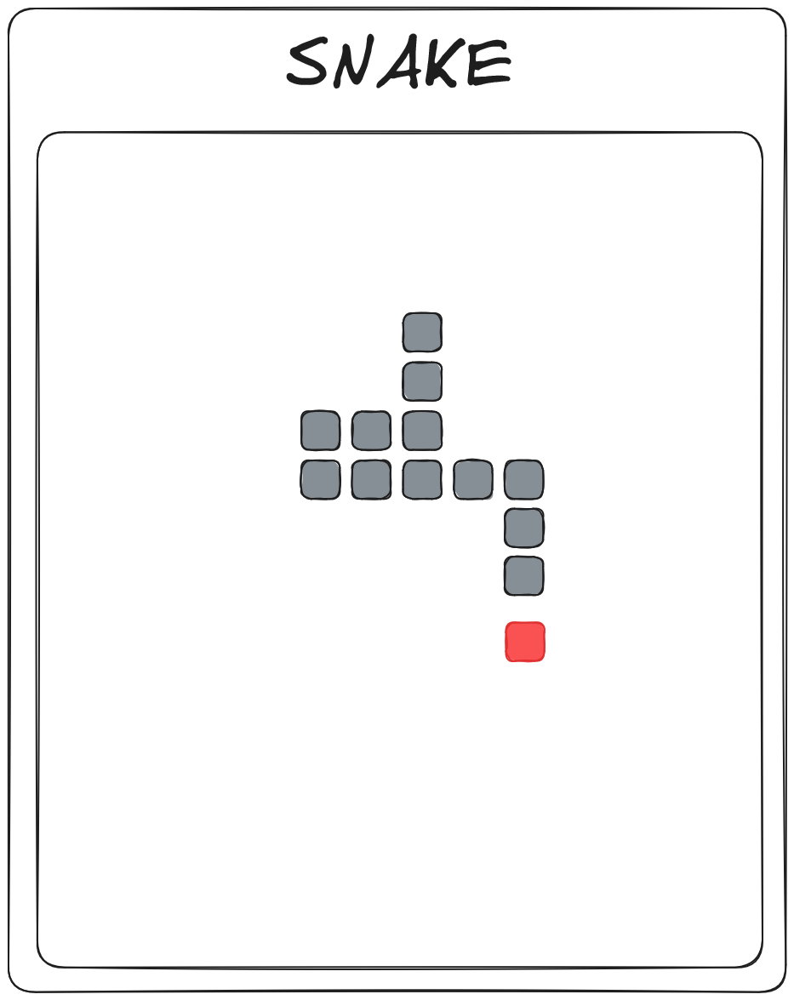
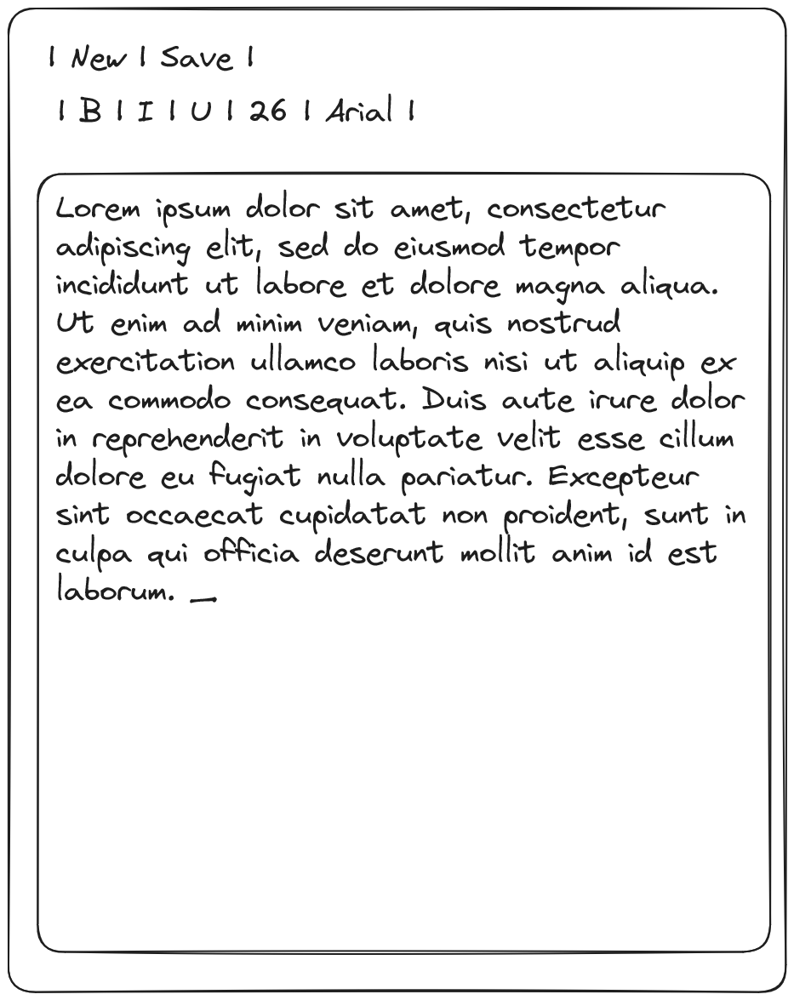
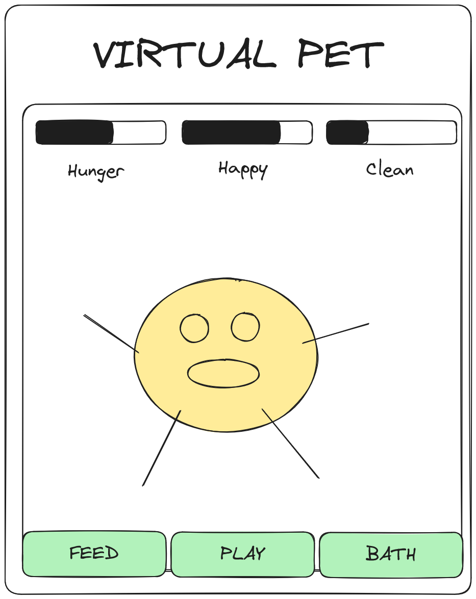
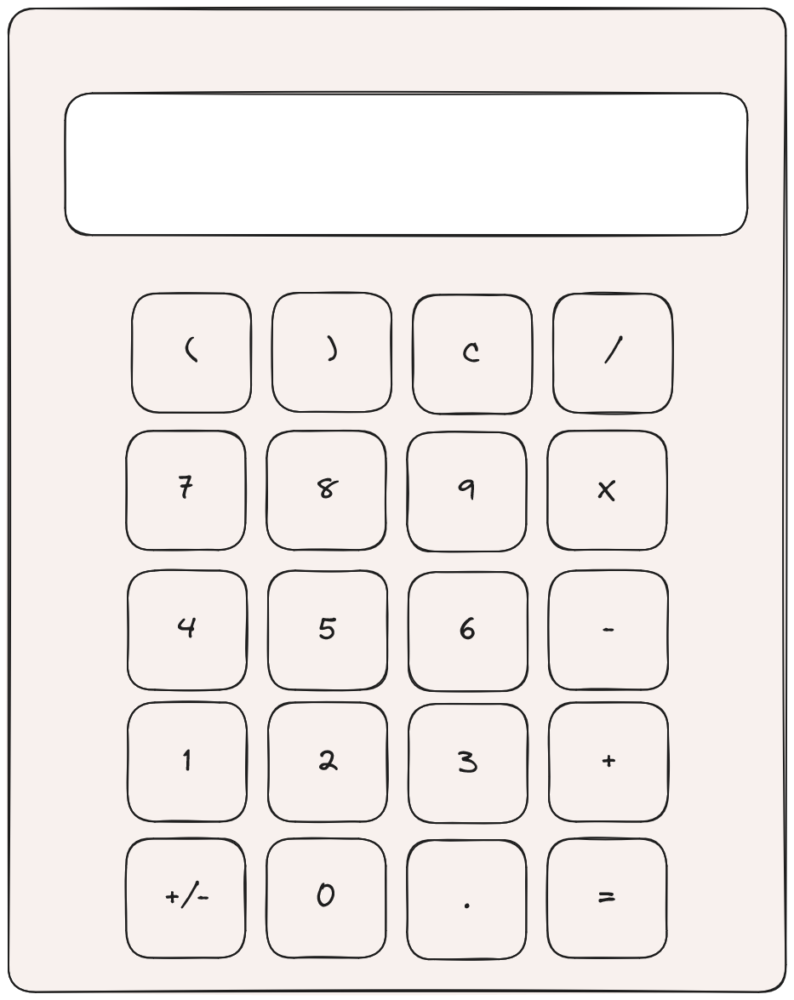

# Project Title
EncoreOS

## Overview

EncoreOS is a website that simulates the experience of using a Windows 95-style operating system. Users will interact with draggable windows containing basic applications such as a calculator, text editor, and classic games.

## Problem

A specific need or pain point does not drive this app but rather aims to explore various design patterns within a single web application. It seeks to revive the nostalgic playfulness of using a Windows 95-style interface in a modern context, inspired by Brenda Laurel's concept of "computers as theatre." The project serves as a creative exploration of interface design and user interaction, contrasting with the streamlined aesthetic prevalent in modern websites.

## User Profile

The app is intended for anyone interested in experiencing a nostalgic, multimedia web interface reminiscent of Windows 95. It will primarily target desktop users.

## Features
1. Multi Window Interface
    - Users can open multiple windows containing different applications at once. The active window will be "on top" at the highest Z axis with the rest stacking in subsequent order.
2. Drag and Drop Functionality
    - Users will be able to drag and drop windows within the limits of the "Screen" Interface
3. File Persistence
    - To better emulate a desktop experience files and data will be persisted across sessions for the user. This includes things such as word documents, high-scores storage for games, and chat messages.
4. Applications
    1. Calculator app: A simple calculator capable of performing basic arithmetic calculations for the user
    2. Word Pad: A simple word pad that will allow the user to type and save their word documents
    3. Pet App: A basic tamagotchi-style pet app that allows the user to manage the needs (hunger, happiness, hygiene) of a virtual pet.
    4. Chat: A websocket-based chat application that will allow users connected to the website at the same time to instant message one another
    5. Snake: The classic game of snake
    

## Implementation

### Tech Stack
- **Framework:** Vanilla JavaScript with React for UI components.
- **Build Tool:** Vite for fast development and modern JavaScript features.
- **Styling:** SCSS (Sass) for styling components.
- **WebSocket:** Used for real-time communication in the chat app.
- **Local Storage:** For persisting user data across sessions

### APIs

### Sitemap

- **Main Window** 
	- **Start Bar**: Contains system icons and a start button.
	- **Desktop Icons**: Icons representing applications or files.
	- **Resizable and draggable windows**: Each window contains different apps or functionalities.
- **Start Menu**
	- **Navigation**: Allows users to navigate through folders and launch applications.
- Window Component
    - Houses the apps as listed above in features

### Mockups

### Roadmap

- **Feature 1**: Implement basic functionality of desktop interaction and start menu**
	- Develop the main UI with the following components
    	- **Screen**
    	- **Start Bar**
    	- and **Desktop Icons**.
	- Implement basic **Start Menu** functionality with navigation.
    	- Create a structure for selectable items and recursive menus for items nested in folders
- **Feature 2: Create draggable and resizable window components**
	- Design and implement draggable and resizable window components.
	- Ensure windows can contain different apps or functionalities.
	- Ensure windows movement are bounded by **Screen Component**
	- Create a stack using state that can be queried to determine window stacking order and get updated on clicking a different window
- **Feature 3: Multi-window Interface**: Further refine the ability to open and manage multiple windows.
- **Feature 4: Persistent Word Documents**
   	 - Ability to write and edit word documents within the application window
   	 - Ability to save documents to local storage JSON,
   	 - Ability to open and further edit Documents
- **Feature 5: WebSocket Chat App:** Start implementing the chat app using WebSocket for real-time messaging.
    - Enable chat connection between users on the website at the same time
- **Feature 6: Calculator App**
    - Perform basic arithmetic operations
- **Feature 7: Snake:**
    - Implement a playable snake game
- **Feature 8: Pet Application**
- **Feature 9: Startup sequence**
- Testing and bug fixing
- DEMO

## Nice-to-haves
Internet Browser
Minesweeper: A clone of the classic windows packed in-game
Paint: A Basic Drawing Program
Mobile Display: Maybe a styling for palm pilot like appearance?
DB Integration if necessary

